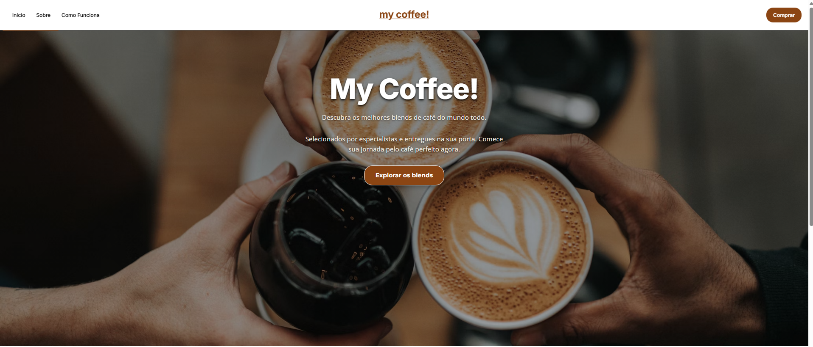
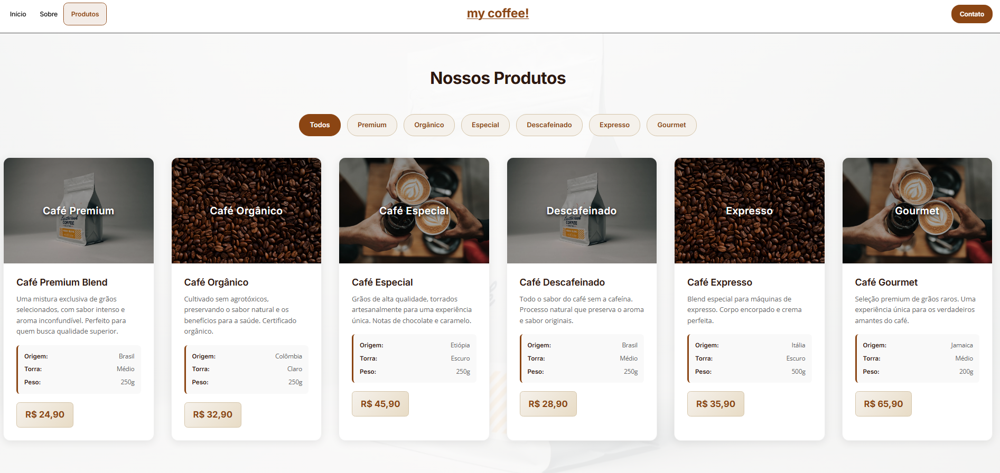
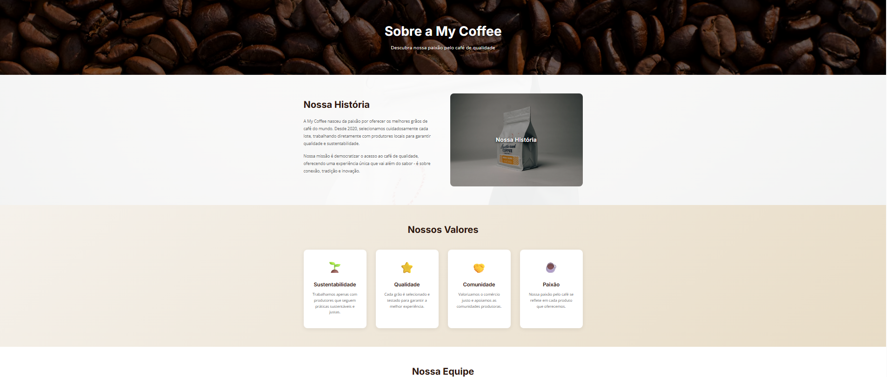

# ☕ My Coffee - Website de Produtos de Café


## 📖 Sobre o Projeto

Este é um projeto de estudo desenvolvido como parte do **PDF "50 Projetos em React"**, onde aprimorei minhas habilidades básicas em React, incluindo componentes, roteamento, estilização e boas práticas de desenvolvimento.

O **My Coffee** é um website completo de produtos de café que demonstra uma aplicação React moderna com navegação entre páginas, catálogo de produtos, formulários e design responsivo.

## 🚀 Funcionalidades

### **Landing Page**
- Hero section com imagem de fundo e overlay
- Seção de produtos em destaque
- Call-to-action para explorar produtos

### **Página de Produtos**
- Catálogo completo com 6 produtos diferentes
- Sistema de filtros por categoria (Premium, Orgânico, Especial, etc.)
- Detalhes técnicos de cada produto (origem, torra, peso)
- Funcionalidade de compra simulada

###  **Página Sobre**
- História da empresa
- Valores e missão
- Perfil do fundador
- Design profissional com seções bem estruturadas

### **Página de Contato**
- Formulário de contato funcional
- Informações de contato completas
- FAQ com perguntas frequentes
- Validação de formulário

## Tecnologias Utilizadas

- **React 19.1.1** - Biblioteca principal
- **Vite 7.1.7** - Build tool e dev server
- **React Router DOM** - Roteamento entre páginas
- **TailwindCSS 4.1.13** - Framework CSS
- **CSS3** - Estilização customizada
- **HTML5** - Estrutura semântica

## Características do Design

### **Paleta de Cores**
- **Primária**: #8B4513 (Marrom café)
- **Secundária**: #A0522D (Marrom claro)
- **Acentos**: #FFD700 (Dourado)
- **Neutros**: Tons de bege e creme

### **Tipografia**
- **Títulos**: Inter (Sans-serif)
- **Corpo**: Open Sans (Sans-serif)
- **Botões**: Montserrat (Sans-serif)

### **Responsividade**
- Design mobile-first
- Breakpoints: 480px, 768px, 1200px
- Grid responsivo para produtos
- Navegação adaptativa

## Instalação e Execução

### Pré-requisitos
- Node.js (versão 20 ou superior)
- npm ou yarn

### Passos para instalação

1. **Clone o repositório**
```bash
git clone https://github.com/seu-usuario/marketing-website.git
cd marketing-website
```

2. **Instale as dependências**
```bash
npm install
```

3. **Execute o projeto**
```bash
npm run dev
```

4. **Acesse no navegador**


## 📱 Screenshots

### Desktop

*Landing page com hero section impactante*


*Catálogo de produtos com filtros*


*Página sobre com informações da empresa*


##  Aprendizados

Este projeto foi fundamental para consolidar meus conhecimentos em:

1. **React Fundamentals** - Componentes, props, state
2. **React Router** - Navegação e roteamento
3. **CSS Moderno** - Flexbox, Grid, responsividade
4. **Acessibilidade** - WCAG 2.1, semântica
5. **UX/UI Design** - Princípios de design e usabilidade

##  Contribuições

Este é um projeto de aprendizado, mas sugestões e melhorias são sempre bem-vindas!

##  Licença

Este projeto é de uso educacional e foi desenvolvido como parte de um exercício de aprendizado.

## 👨‍💻 Autor

- LinkedIn: [seu-linkedin](https://linkedin.com/in/seu-linkedin)

---

⭐ **Se este projeto te ajudou de alguma forma, considere dar uma estrela!**

*Desenvolvido com ☕ e ❤️ como parte do aprendizado em React*